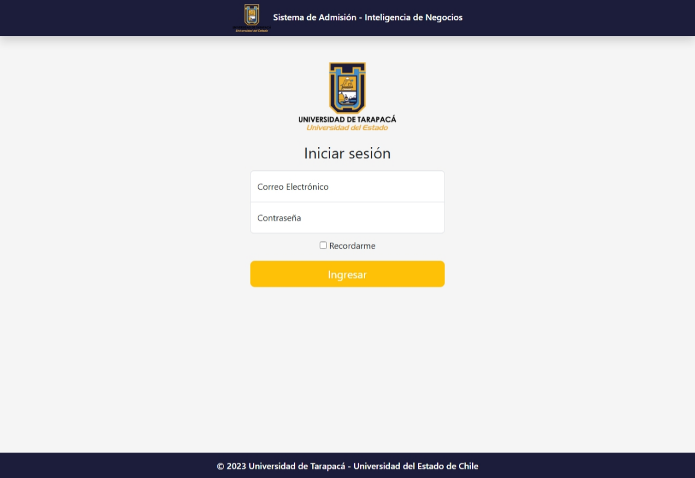
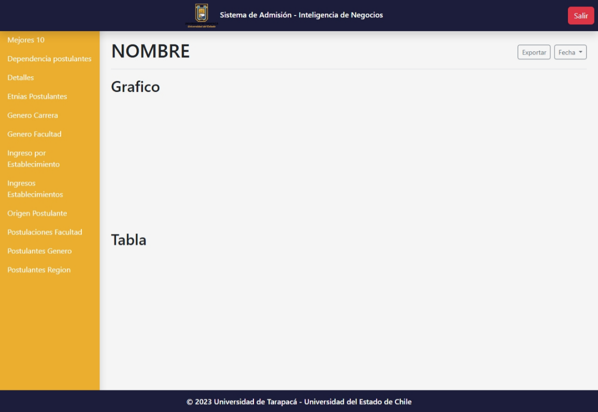

# Admision-UTA 

---

## 🎓 Sistema de Información para el Área de Admisión  
**Universidad de Tarapacá**

Este proyecto es un sistema de información diseñado para mejorar y facilitar la gestión del área de admisión de la Universidad de Tarapacá. Con una estructura modular, base de datos relacional y componentes visuales, el sistema proporciona una plataforma eficiente y escalable para recopilar, analizar y administrar datos relevantes del proceso de admisión estudiantil.

---

## 🖼️ Interfaz Visual

El sistema cuenta con una interfaz web clara y funcional. A continuación se muestran capturas de las principales pantallas:

### 🔐 Pantalla de inicio de sesión  

Esta vista permite el acceso seguro al sistema. El usuario debe ingresar correo y contraseña registrados previamente en la base de datos.

---

### 🧭 Menú principal del sistema  

Una vez autenticado, el usuario accede al panel de control con opciones organizadas para gestionar las funciones de admisión.

---

## 📡 Tecnologías usadas

- `PHP` para la lógica del lado del servidor.
- `PosgreSQL-MySQL` como sistema de gestión de base de datos.
- `HTML/CSS` para las interfaces.
- `PDO` para la conexión segura a la base de datos.

---

## 🚀 Objetivo del proyecto

Este sistema busca **reducir los tiempos de gestión manual**, mejorar la accesibilidad a la información académica y brindar un entorno robusto para el análisis administrativo del área de admisión de la universidad.

---

## 👨‍💻 Autores

Alumnos uta

